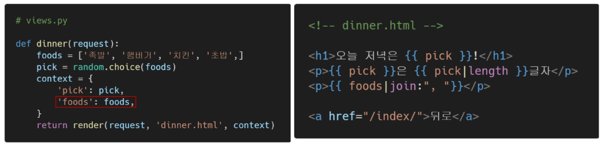

# Django

---

## 1. Django The Web Framework

* Django is a high-level **Python Web framework** that encourages rapid development and clean, pragmatic design.
* It takes care of much of the hassle of Web development, so **you can focus on writing your app without needing to reinvent the wheel**.

### 1.1. Web

* World Wide Web
* 인터넷에 연결된 컴퓨터를 통해 정보를 공유할 수 있는 전 세계적인 정보 공간

#### Static web page(정적 웹 페이지)

* 서버에 미리 저장된 파일이 사용자에게 그대로 전달되는 웹 페이지

* 서버가 정적 웹 페이지에 대한 요청을 받은 경우

  서버는 추가적인 처리 과정 없이 클라이언트에게 응답을 보냄

* 모든 상황에서 모든 사용자에게 동일한 정보를 표시

* 일반적으로 HTML, CSS, JavaScript로 작성됨

* flat page 라고도 함

#### Dynamic web page(동적 웹 페이지)

* 웹 페이지에 대한 요청을 받은 경우 서버는 추가적인 처리 과정 이후 클라이언트에게 응답을 보냄

* 동적 웹 페이지는 방문자와 상호작용하기 때문에 내용은 그때그때 다름

* 서버 사이드 프로그래밍 언어(Python, Java, C++ 등)가 사용되며,

  파일을 처리하고 데이터베이스와의 상호작용이 이루어짐

### 1.2. Framework

* 프로그래밍에서 특정 운영체제를 위한 응용 프로그램 표준 구조를 구현하는 클래스와 라이브러리 모임
* 재사용할 수 있는 수많은 코드를 프레임워크로 통합함으로써 개발자가 새로운 애플리케이션을 위해 표준 코드를 다시 작성하지 않아도 같이 사용할 수 있음
* Application framework 라고도 함
* **웹 페이지를 개발하는 과정에서 겪는 어려움을 줄이는 것이 주 목적**으로 데이터베이스 연동, 템플릿 형태의 표준, 세션 관리, 코드 재사용 등의 기능을 포함
* 동적인 웹 페이지나, 웹 애플리케이션, 웹 서비스 개발 보조용으로 만들어지는 Application framework의 일종

### 1.3. Django를 사용해야 하는 이유

* 검증된 Python 언어 기반 Web framework
* 대규모 서비스에도 안정적이며 오랫동안 세계적인 기업들에 의해 사용됨


### 1.4. Framework Architechture

* MVC Design Pattern (model-view-controller)
* 소프트웨어 공학에서 사용되는 디자인 패턴 중 하나
* 사용자 인터페이스로부터 프로그램 로직을 분리해 애플리케이션의 시각적인 요소나 이면에서 실행되는 부분을 서로 영향 없이 쉽게 고칠 수 있는 애플리케이션을 만들 수 있음
* Django는 MTV Pattern이라고 함

### 1.5. MTV Pattern

* Model
  * 응용프로그램의 데이터 구조를 정의하고 데이터베이스의 기록을 관리(추가, 수정, 삭제)
* Template
  * 파일의 구조나 레이아웃을 정의
  * 실제 내용을 보여주는 데 사용(presentation)
* View
  * HTTP 요청을 수신하고 HTTP 응답을 반환
  * Model을 통해 요청을 충족시키는데 필요한 데이터에 접근
  * template에게 응답의 서식 설정을 맡김


### 1.6. Django의 응답 처리과정


---

## 2. Django 프로그래밍

### 2.1. Django 시작하기

* VScode에 Django와 Excel Viewer 확장도구 설치

  

* Django extension 설정

  ```
  ctrl(command) + shift + p -> json 검색 -> Preferences: Open Settings (JSON) 선택
  ```

  내부 딕셔너리에 아래 내용 추가

  ```javascript
  // settings.json
  
  {
    ... 생략 ...,
  
    // Django
    "files.associations": {
      "**/*.html": "html",
  	    "**/templates/**/*.html": "django-html",
      "**/templates/**/*": "django-txt",
      "**/requirements{/**,*}.{txt,in}": "pip-requirements"
    },
    "emmet.includeLanguages": {
      "django-html": "html"
    }
  }
  ```

* Django 설치 전 **가상환경 생성 및 활성화**

  ```Bash
  $ python -m venv venv
  ```

  ```bash
  $ source venv/Scripts/activate
  ```

  이후 pip list로 가상환경 작동 여부 확인

* Django 설치 (현재 3.2가 LTS)

  ```bash
  $ pip install django==3.2
  ```

  세부 버전까지 설정하고 싶으면 3.2.12도 가능 // 명시하지 않으면 4.0 버전이 설치됨 - LTS 지원 안됨

* 프로젝트 생성

  ```bash
  $ django-admin startproject <프로젝트명> .
  ```

  프로젝트 이름에는 Python이나 Django에서 사용중인 키워드를 피해야함

  '-'(하이픈)도 사용할 수 없음

  ex) Django, text, class, django-test 등

* Django 서버 시작하기(활성화)

  ```bash
  $ python manage.py runserver
  ```

* 메인 페이지 로켓 확인

  

#### [참고] LTS

* Long Term Support (장기 지원 버전)
* 일반적인 경우보다 장기간에 걸쳐 지원하도록 고안된 소프트웨어의 버전
* 컴퓨터 소프트웨어의 제품 수명주기 관리 정책
* 배포자는 LTS 확정을 통해 장기적이고 안정적인 지원을 보장함

### 2.2. 프로젝트 구조


* `__init__.py` (별도 수정 X)
  * Python에게 이 디렉토리를 하나의 Python 패키지로 다루도록 지시
* asgi.py (배포 배우기 전까진 별도 수정 X)
  * Asynchronous Server Gateway Interface
  * Django 애플리케이션이 비동기식 웹 서버와 연결 및 소통하는 것을 도움

* **Setting.py** (주로 수정할 파일)

* 애플리케이션의 모든 설정을 포함

* **urls.py** (주로 수정할 파일)

  * 사이트의 url과 적절한 views의 연결을 지정

* wsgi.py (배포 배우기 전까지 별도 수정 X)

  * Web Server Gateway Interface
  * Django 애플리케이션이 웹서버와 연결 및 소통하는 것을 도움

* **manage.py** (주로 수정할 파일)

  * Django 프로젝트와 다양한 방법으로 상호작용 하는 커맨드라인 유틸리티

  ```bash
  # manage.py Usage
  $ python manage.py <command> [options]
  ```

### 2.3. Application 생성

* 일반적으로 Application명은 **복수형**으로 하는 것을 권장

  ```bash
  $ python manage.py startapp <app이름>
  ```

  #### Application 구조

  

* apps.py
  * 앱의 정보가 작성된 곳
* models.py
  * 앱에서 사용하는 Model을 정의하는 곳
* test.py
  * 프로젝트의 테스트 코드를 작성하는 곳
* views.py
  * view 함수들이 정의 되는 곳

### 2.4. Project & Application

* Project
  * Project(이하 프로젝트)는 Application(이하 앱)의 집합 (collection of apps)
  * 프로젝트에는 여러 앱이 포함될 수 있음
  * 앱은 여러 프로젝트에 있을 수 있음
* Application
  * 앱은 실제 요청을 처리하고 페이지를 보여주고 하는 등의 역할을 담당
  * 하나의 프로젝트는 여러 앱을 가짐
  * 일반적으로 앱은 하나의 역할 및 기능 단위로 작성함

#### 앱 등록

* 프로젝트에서 앱을 사용하기 위해서는 반드시 INSTALLED_APPS 리스트에 추가해야 함
* INSTALLED_APPS
  * Django installation에 활성화 된 모든 앱을 지정하는 문자열 목록

#### 앱 생성 시 주의사항

* **" 반드시 생성 후 등록!!"**

* INSTALLED_APPS에 먼저 작성(등록)하고 생성하면 앱이 생성되지 않음

* 앱 등록 시 순서

  

  해당 순서를 지키지 않아도 일반적인 작성 및 구동에 문제가 없지만, 추후 advanced한 내용을 대비하기 위해 지키는 것을 권장

---

## 3. 요청과 응답

### 3.1. URLs


* HTTP 요청(request)을 알맞은 view로 전달

### 3.2. View


* HTTP 요청을 수신하고 HTTP 응답을 반환하는 함수 작성
* Model을 통해 요청에 맞는 필요 데이터에 접근
* Template에게 HTTP 응답 서식을 맡김

### 3.3. Templates


* 실제 내용을 보여주는데 사용되는 파일
* 파일의 구조나 레이아웃을 정의 (ex. HTML)
* Template 파일 경로의 기본값은 **app 폴더 안의 templates 폴더**로 지정되어 있음

### 3.4. 추가 설정

* LANGUAGE_CODE
  * 모든 사용자에게 제공되는 번역을 결정
  * 이 설정이 적용 되려면 USE_I18N이 활성화되어 있어야 함
  * language-identifiers 참조
* TIME_ZONE
  * 데이터베이스 연결의 시간대를 나타내는 문자열 지정
  * USE_TZ가 True이고 이 옵션이 설정된 경우 데이터베이스에서 날짜 시간을 읽으면, UTC 대신 새로 설정한 시간대의 인식 날짜 & 시간이 반환 됨
  * USE_TZ이 False인 상태로 이 값을 설정하는 것은 error가 발생하므로 주의
  * List of tz database time zones 참조
* USE_I18N
  * Django의 번역 시스템을 활성화해야 하는지 여부 지정
* USE_L10N
  * 데이터의 지역화 된 형식(localized formatting)을 기본적으로 활성화할지 여부를 지정
  * True일 경우, Django는 현재 locale의 형식을 사용하여 숫자와 날짜를 표시
* USE_TZ
  * datetimes가 기본적으로 시간대를 인식하는지 여부를 지정
  * True일 경우 Django는 내부적으로 시간대 인식 날짜 / 시간을 사용

---

## 4. Template

### 4.1. Django Template

* 데이터 표현을 제어하는 도구이자 표현에 관련된 로직
* 사용하는 built-in system
  * Django template language

### 4.2. Django Template Language (DTL)

* Django template에서 사용하는 built-in template system
* 조건, 반복, 변수 치환, 필터 등의 기능을 제공
* 단순히 Python이 HTML에 포함된 것이 아니며, 프로그래밍적 로직이 아니라 **프레젠테이션을 표현하기 위한 것**
* Python처럼 일부 프로그래밍 구조(if, for등)를 사용할 수 있지만, 이것은 해당 Python 코드로 실행되는 것이 아님

### 4.3. DTL Syntax

#### Variable

```django
{{ variable }}
```

* render()를 사용해 views.py에서 정의한 변수를 template 파일로 넘겨 사용하는 것

* 변수명은 영어, 숫자와 밑줄(_)의 조합으로 구성될 수 있으나 밑줄로는 시작 할 수 없음

  * 공백이나 구두점 문자 또한 사용할 수 없음

* dot(.)를 사용하여 변수 속성에 접근할 수 있음

  ex) 리스트의 인덱스 참조 `list명.인덱스번호`

* render()의 세번째 인자로 {'key': value}와 같이 딕셔너리 형태로 넘겨주며, 여기서 정의한 key에 해당하는 문자열이 template에서 사용 가능한 변수명이 됨

#### Filters

```django
{{ variable|filter }}
```

* 표시할 변수를 수정할 때 사용

  ex)

  * name 변수를 모두 소문자로 출력

  ```django
  {{ name|lower }}
  ```

* 60개의 built-in template filters를 제공

* chained가 가능하며 일부 필터는 인자를 받기도 함

  ex)

  ```django
  {{ variable|truncatewords:30 }}
  ```

#### Comments

```django
{# #}
```

* Django template에서 라인의 주석을 표현하기 위해 사용

* 아래처럼 유효하지 않은 템플릿 코드가 포함될 수 있음

  ```django
  {#  text  #}
  ```

* 한 줄 주석에만 사용할 수 있음 (줄 바꿈이 허용되지 않음)

* 여러 줄 주석은 와  사이에 입력

  ```django
  
  	주석
  	주석
  
  ```

### 4.4. 코드 작성 순서

* 데이터의 흐름에 맞추어 작성
  1. urls.py
  2. views.py
  3. templates

### 4.5. 실습해보기

#### Variable 연습

연습 1.


연습 2.


연습 3.


#### Filters 연습



#### Tags 연습


#### comments 연습


### 4.6. Template inheritance (템플릿 상속)

* 템플릿 상속은 기본적으로 코드의 재사용성에 초점을 맞춤
* 템플릿 상속을 사용하면 사이트의 모든 공통 요소를 포함하고, 하위 템플릿이 재정의(override) 할 수 있는 블록을 정의하는 기본 "skeleton" 템플릿을 만들 수 있음


