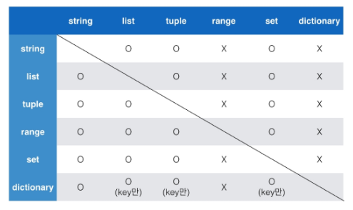

# Python 기초

## 파이썬의 특징

* 파이썬(python)은 다른 프로그래밍 언어보다 문법이 간단하면서도 엄격하지 않음

  > ex) 변수에 별도의 타입 지정이 필요 없음

* 문법 표현이 매우 간결해서 프로그래밍 경험이 없어도 짧은 시간 내에 마스터 할 수 있음

  >ex) 문장을 구분할 때 중괄호 ({}) 대신 들여쓰기를 사용

* Expressive Language

  > ex) 같은 작업에 대해서도 C나 Java보다 더 간결하게 작성 가능
  >
  > ```C
  > # include<stdio.h>
  > 
  > int main (void) {
  >     printf("Hello World!");
  >     return 0;
  > }
  > ```
  >
  > ```java
  > public class HelloWorld {
  >     public static void main(String[] args) {
  >         System.out.println("Hello World!")
  >     }
  > }
  > ```
  >
  > ```python
  > print('Hello World!')
  > ```

* 크로스 플랫폼 언어

  윈도우즈(Windows), macOS, 리눅스(Linux), 유닉스(Unix) 등 다양한 운영체제에서 실행 가능

* 인터프리터 언어(Interpreter)

  * 소스코드를 기계어로 변환하는 컴파일 과정 없이 바로 실행 가능
  * 코드를 대화하듯 한 줄 입력하고 실행한 후, 바로 확인할 수 있음

* 객체 지향 프로그램(Object Oriented Programming)

  파이썬은 객체지향 언어이며, 모든 것이 객체로 구현되어 있음

  객체(object) : 숫자, 문자, 클래스 등 값을 가지고 있는 모든 것

  

## 파이썬 개발 환경

### 대화형 환경

* 파이썬 **기본 Interpreter** : IDLE (Intergrated Development and Learning Environment)
  * 내장 프로그램으로 파이썬 설치 시 기본적으로 설치 - 인터프리터가 대화형 모드로 동작함
  * 여러 줄의 코드가 작성되는 경우 보조 프롬프트(...)가 사용됨
  * 프롬프트(>>>)에 코드를 작성하면 해당 코드가 실행됨
  * Python이 설치된 환경에서는 기본적으로 활용 가능하나 디버깅 및 코드 편집, 반복 실행이 곤란
* **Jupyter Notebook** : 웹 브라우저 환경에서 코드를 작성할 수 있는 오픈소스
  * Syntax Highlighting, Indentation, Tab completion 등 편의 기능 제공
  * 브라우저에서 코드를 실행하고 결과를 확인할 수 있음
  * HTML, LaTeX, PNG, SVG을 바탕으로 다양한 표현이 가능
  * Markdown을 기반으로 문서 작성이 가능
  * 데이터분석/머신러닝/딥러닝 시 많이 활용 가능하며, Google colab 등 유사한 환경의 서비스도 있음
* **pycharm**
* **VS code**

### 스크립트 실행

파이썬 프로그램(.py) 파일을 작성하고, IDE 혹은 Text Editor 활용

## 기초문법

### 코드 스타일 가이드

코드를 **'어떻게 작성할지'**에 대한 가이드라인 - 일관적인 코드 작성스타일을 유지

* 파이썬에서 제안하는 스타일 가이드 : [PEP8](https://www.python.org/dev/peps/pep-0008/)
* 기업, 오픈소스 등에서 사용되는 스타일 가이드 : [Google Style guide](https://google.github.io/styleguide/pyguide.html) 등

### 들여쓰기(Identation)

Space Sensitive

* 문장을 구분할 때, 중괄호({}) 대신 <들여쓰기(indentation)>를 사용
* 들여쓰기 할 때는 4칸(space 4번) 혹은 1탭(Tab 1번)을 입력
  * 주의! 한 코드 안에서는 반드시 한 종류의 들여쓰기만 사용 - 혼용하면 안됨
  * 원칙적으로는 공백(빈칸, space) 사용을 권장 (PEP8)

### 변수

컴퓨터 메모리 어딘가에 저장되어 있는 객체를 참조하기 위해 사용되는 이름

* 파이썬은 객체지향 언어로 모든것이 객체로 구현되어 있음

* 동일 변수에 다른 객체를 언제든 할당할 수 있기 때문에, 즉, 참조하는 객체가 바뀔 수 있기 때문에 '변수'라고 불림

* 변수는 할당 연산자(=)를 통해 값을 할당(assignment)

  * type() : 변수에 할당된 값의 타입
  * id() : 변수에 할당된 값(객체)의 고유한 아이덴티티(identity) 값이며, 메모리주소

* 변수 할당

  * 같은 값을 동시에 할당할 수 있음

  ```python
  x = y = 1004
  print(x, y)	>>>	1004 1004
  ```

  * 다른 값을 동시에 할당할 수 있음(multiple assignment)

  ```python
  x, y = 1, 2	#	x, y = (1, 2)와 동일, 언패킹 이용
  print(x, y)	>>> 1 2
  x, y = y, x	# 서로 값 바꾸기도 가능
  print(x, y)	>>> 2 1
  ```

  ​	다른 값의 동시 할당은 튜플을 이용하는 방식 - 인자의 수가 다르면 에러 발생

* 변수 연산

  ```python
  i = 5 ; j = 3; s = '파이썬'
  
  i + j	>>> 8
  
  i * j / 3	>>> 5.0
  
  i = i - j
  print(i)	>>>	2
  
  j = -2
  i * j	>>>	-4
  
  '안녕' + s	>>>	'안녕파이썬'		#문자열에 대한 연산도 가능
  
  s = s * 3
  print(s)	>>>	'파이썬파이썬파이썬'
  
  s = 'Python'
  s + ' is fun'	>>>	'Python is fun'
  ```

### 식별자(Identifiers)

파이썬 객체(변수, 함수, 모듈, 클래스 등)를 식별하는데 사용하는 이름(name)

규칙

* 식별자의 이름은 영문 알파벳, 언더스코어(_), 숫자로 구성

* 첫 글자에 숫자가 올 수 없음

* 길이제한이 없고, 대소문자를 구별

* 다음의 키워드(keywords)는 예약어(reserved words)로 사용할 수 없음

  ```python
  False, None, True, __peg_parser__, and, as, assert, async, await, break, class, continue, def, del, elif, else, except, finally, for, from, global, if, import, in, is, lambda, nonlocal, not, or, pass, raise, return, try, while, with, yield
  ```

  이들 키워드들은 내장함수나 모듈 등의 이름으로도 만들면 안됨 - 기존 이름에 다른 값을 할당하게 되므로 더 이상 동작하지 않게 됨

### 사용자 입력

사용자로부터 값을 즉시 입력 받을 수 있는 내장함수

```python
input([prompt])
```

* 대괄호 부분에 문자열을 넣으면 입력 시, 해당 문자열을 출력할 수 있음
* 반환값은 항상 **문자열**의 형태로 변환

### 주석(Comment)

코드에 대한 설명

* 중요한 점이나 다시 확인해야 하는 부분을 표시
* 컴퓨터는 주석을 인식하지 않음, 사용자만을 위한 것
* 개발자에게 주석을 다는 습관은 매우 중요
* 쉬운 이해와 코드의 분석 및 수정이 용이
  * 주석은 코드 실행에 영향을 미치지 않을 뿐만 아니라 프로그램의 속도, 용량에도 영향 없음

한 줄 주석

* 주석으로 처리될 내용 앞에 **#**을 입력
* 한 줄을 온전히 사용할 수도 있고, 그 줄 코드 뒷부분에 작성할 수 있음

``` python
# 이름을 출력합니다.
print('홍길동') # 이름은 홍길동
```

여러 줄의 주석

* 한 줄씩 **#**을 사용하거나 '''또는 """으로 표현
  * '''또는 """으로 표현하는 방법은 docstirng을 위해 사용
  * docstring은 함수/클래스의 설명을 작성하는데 사용

## 자료형(Datatype)

### 자료형 분류

* 불린형(Boolean Type)

  True/False 값을 가진 타입

  비교/논리 연산을 수행함에 있어서 활용됨

  다음은 모두 False로 변환 - `0, 0.0 , (), [], {}, '', None`

* 수치형(Numeric Type)

  * int(정수, integer)

    * 모든 정수의 타입은 int

      Python 3부터는 long 타입은 없고, 모두 int로 표기 됨

      여타 프로그래밍 언어, python 2에서는 OS 기준 32/64비트

    * 매우 큰 수를 나타낼 때 오버플로우가 발생하지 않음

      오버플로우(overflow) : 데이터 타입별로 사용할 수 있는 메모리의 크기를 넘어서는 상황

      Arbitrary percision arithmetic(임의 정밀도 산술)을 통해 고정된 형태의 메모리가 아닌 가용 메모리들	을 활용하여 모든 수 표현에 활용

    * 진수 표현

      2진수 : 0b

      8진수 : 0o

      16진수 : 0x

  * float(부동소수점, 실수,floating point number)

    정수가 아닌 모든 실수는 float 타입

    부동소수점 : 실수를 컴퓨터가 표현하는 방법 - 2진수(비트)로 숫자를 표현

    * 이 과정에서 floating point rounding error가 발생하여, 예상치 못한 결과가 발생
    * 값 비교하는 과정에서 정수가 아닌 실수인 경우 주의할 것
      * 임의의 작은 수를 이용해 비교
      * sys 모듈을 이용해 sys.float_info.epsilon으로 입실론 값 이용
      * math 모듈을 이용해 math.isclose(a, b)로 비교

  * complex(복소수, complex number)

    실수부와 허수부로 구성된 복소수는 모두 complex 타입 - 허수부를 j로 표현

* 문자열(String Type)

  모든 문자는 str타입

  Immutable (부분 수정 불가) / Iterable(순환 참조 가능)

  * 문자열은 작은 따옴표(')나 큰 따옴표(")를 활용하여 표기

    * 문자열을 묶을 때 동일한 문장부호를 활용

    * PEP8에서는 소스코드 내에서 하나의 문장부호를 선택하여 유지하도록 함

  * 중첩따옴표(Nested Quotes) - 따옴표 안에 따옴표를 표현할 경우

    * 작은 따옴표가 들어 있는 경우에는 큰 따옴표로 문자열 생성
    * 큰 따옴표가 들어 있는 경우에는 작은 따옴표로 문자열 생성

  * 삼중따옴표(Triple Quotes)

    * 따옴표 안에 따옴표를 넣을 때
    * 여러 줄을 나눠 입력할 때 편리

  * Escape sequence

    * 문자열 내에서 특정 문자나 조작을 위해서 역슬래시(`\`)를 활용하여 구분

    | 예약문자 |   내용(의미)    |
    | :------: | :-------------: |
    |   `\n`   |     줄 바꿈     |
    |   `\t`   |       탭        |
    |   `\r`   |   캐리지리턴    |
    |   `\0`   |    널(Null)     |
    |   `\\`   |       `\`       |
    |   `\'`   | 단일인용부호(') |
    |   `\"`   | 이중인용부호(") |

  * 문자열을 변수를 활용하여 만드는 법

    * % -formatting (잘 안씀)
    * str.format()
    * f-strings (python 3.6이상)

    ```python
    name = '홍길동'; score = 4.5
    print('Hello, %s. 성적은 %f' % (name, score))			# %-formatting
    print('Hello, {}. 성적은 {}'.format(name, score))		# str.format()
    print(f'Hello, {name}. 성적은 {score}')				# f-strings
    ```

    

* None

  값이 없음을 표현하기 위한 타입 None Type

  일반적으로 반환 값이 없는 함수에서 사용하기도 함

## 컨테이너

여러 개의 값을 담을 수 있는 것(객체)으로, **서로 다른 자료형을 저장**할 수 있음

### 컨테이너의 분류

순서가 있는 데이터(Ordered) vs. 순서가 없는 데이터 (Unordered)

주의! 순서가 있다 != 정렬되어 있다

* 시퀀스형

  * **리스트** - 순서를 가지는 0개 이상의 객체를 참조하는 자료형

    생성된 이후 내용 변경이 가능 = 가변자료형

    유연성 때문에 파이썬에서 가장 흔히 사용

    항상 대괄호 형태로 출력

    * 생성과 접근

      대괄호([]) 혹은 list()를 통해 생성

      순서가 있는 시퀀스로 인덱스를 통해 접근 가능 (`리스트명[index]`)

      |      List      | 객체 1 | 객체 2 | 객체 3 | 객체 4 |
      | :------------: | :----: | :----: | :----: | :----: |
      | Positive index |   0    |   1    |   2    |   3    |
      | Negative index |   -4   |   -3   |   -2   |   -1   |

      ```python
      boxes = ['A', 'B', ['apple','banana','cherry']]
      len(boxes)	>>>	3
      boxes[-1][1][0]	>>>	'b' # 천천히 각 객체들을 따라가보자
      ```

  * **튜플** - 순서를 가지는 0개 이상의 객체를 참조하는 자료형

    생성 후, 담고있는 객체 변경이 불가 = 불변자료형(immutable)

    항상 소괄호 형태로 출력

    * 생성과 접근

      소괄호(()) 혹은 tuple()을 통해 생성

      튜플은 수정 불가능한 시퀀스로 인덱스로 접근 가능 (`튜플명[index]`)

      하나의 항목으로 구성된 튜플은 생성 시 값 뒤에 쉼표를 붙여야 함

      튜플은 일반적으로 파이썬 내부와 함수에서 복수의 값 반환하는 경우에 활용

    * 튜플 대입

      우변의 값을 좌변의 변수에 한번에 할당하는 과정

      ```python
      x, y = 1, 2		# 실제로는 튜플로 처리됨
      x, y = (3, 4)	# 두 표현은 내부적으로 동일한 것
      ```

  * **레인지**

    숫자의 시퀀스를 나타내기 위해 사용

    * 기본형 : range(n)

      0 ~ n-1까지의 숫자의 시퀀스

    * 범위 지정 : range(n, m) 

      n ~ m-1까지의 숫자의 시퀀스

    * 범위 및 스텝 지정 : range(n, m , s)

      n부터 m-1까지 s만큼 증가시키며 숫자의 시퀀스

* 비시퀀스형

  * **세트(set)** - 순서없이 0개 이상의 해시가능한 객체를 참조하는 자료형

    해시 가능한 객체(immutable)만 담을 수 있음

    담고있는 객체를 삽입 변경, 삭제 가능 = 가변자료형(mutable)

    중복없이 순서가 없는 자료구조 - 수학의 집합과 같은 구조, 집합연산 가능

    순서가 없어 별도의 값에 접근할 수 없음

    * 생성

      중괄호({}) 혹은 set()을 통해 생성

      빈 Set를 만들기 위해서는 set()을 반드시 활용해야 함

    * 세트 활용

      다른 컨테이너에서 중복된 값을 쉽게 제거할 수 있음

      단, 이후 순서가 무시되므로 순서가 중요한 경우 사용할 수 없음

  * **딕셔너리** - 순서 없이 키-값(key-value) 쌍으로 이뤄진 객체를 참조하는 자료형

    Dictionary의 키(key) : 해시가능한 불변 자료형(immutable)만 가능

    ​										(string, integer, float, boolean, tuple, range)

    각 키의 값 (values) : 어떠한 형태든 관계 없음

    * 생성과 접근

      중괄호({}) 혹은 dict()을 통해 생성

      key를 통해 value에 접근 (`딕셔너리명[key]`)

## 형 변환(Typecasting)

파이썬에서 데이터 형태는 서로 변환할 수 있음

* 암시적 형 변환 (Implicit)

  사용자가 의도하지 않고, 파이썬 내부적으로 자료형을 변환 하는 경우

* 명시적 형 변환 (Explicit)

  사용자가 특정 함수를 활용하여 의도적으로 자료형을 변환 하는 경우

  * int

    * str*, float => int

    ```python
    int('3') + 4	>>>	7
    int(3.5) + 4	>>>	7
    int('3.5') + 4	>>>	ValueError # 3.5는 정수형이 아님! str -> int 변환시 문제 발생
    ```

  * float

    * str*, int => float

    ```python
    float('3.5') + 3.5	>>>	7.0
    float('3')	>>>	3.0
    float('3/4') + 5.3	>>>	ValueError # 3/4는 float 형태가 아님!
    ```

  * str

    * int, float, list, tuple, dict => str

  주의! 형식에 맞는 문자열만 가능!

## 연산자

### 연산자의 종류

* 산술 연산자 (Arithmetic Operator)

  기본적인 사칙연산 및 수식 계산

  | 연산자 |   내용   |
  | :----: | :------: |
  |   +    |   덧셈   |
  |   -    |   뺄셈   |
  |   *    |   곱셉   |
  |   /    |  나눗셉  |
  |   //   |    몫    |
  |   %    |  나머지  |
  |   **   | 거듭제곱 |

* 비교 연산자 (Comparison Operator)

  값을 비교하며, True/False 값을 리턴함

  | 연산자 |            내용             |
  | :----: | :-------------------------: |
  |   <    |            미만             |
  |   <=   |            이하             |
  |   >    |            초과             |
  |   >=   |            이상             |
  |   ==   |            같음             |
  |   !=   |          같지않음           |
  |   is   |    객체 아이덴티티(OOP)     |
  | is not | 객체 아이덴티티가 아닌 경우 |

* 논리 연산자 (Logical Operator)

  일반적으로 비교연산자와 함께 사용됨

  | 연산자  |              내용              |
  | :-----: | :----------------------------: |
  | A and B |    A와 B 모두 True 시, True    |
  | A or B  |   A와 B 모두 False 시, False   |
  |   Not   | True를 False로, False를 True로 |

  * **논리 연산자의 단축평가**

    결과가 확실한 경우 두 번째 값은 확인하지 않음

    ```python
    a = 5 and 4	>>>	5는 True, 4까지 True인걸 확인해야 함 / a = 4
    b = 5 or 3	>>>	5는 True, 뒤를 안봐도 참 / b = 5
    c = 0 and 5	>>>	0은 False, 뒤를 안봐도 거짓 / c = 0
    d = 0 or 3	>>>	0은 False, 3은 True 확인해야 함 / d = 3
    ```

* 복합 연산자 (In-place Operator)

  연산과 대입이 함께 이루어지는 연산자 (`+=`, `-=`, `*=` 등)

* 멤버십 연산자 (Membership Operator)

  `in` 연산자를 통해 특정 요소가 속해 있는지 여부 확인 / 반대는 `not in`

* 식별 연산자 (Identity Operator)

  `is` 연산자를 통해 동일한 객체(Object)인지 확인 가능함 => OOP에서 추가 학습 / 반대는 `is not`

* 시퀀스형 연산자 (Sequence Type Operator)

  산술연산자 (+) : 시퀀스 간의 concatenation(연결/연쇄)

  반복연산자 (*) : 시퀀스를 반복

  ```python
  'Hello' + 'World'	>>>	HelloWorld
  'Hello' * 3			>>>	HelloHelloHello
  ```

* 기타 (Indexing/Slicing)

  * 인덱싱 : 시퀀스의 특정 인덱스 값에 접근

    해당 인덱스가 없는 경우 IndexError

  * 슬라이싱 : 시퀀스를 특정 단위로 슬라이싱 (문자열명[시작 : 끝(포함X) : 스텝])

    ```python
    s = 'abcdefghi'	# 0 ~ 8 또는 -9 ~ -1의 인덱스
    s[2:5]		>>>	'cde'
    s[-6:-2]	>>>	'defg'
    s[2:-4]		>>>	'cde'
    s[2:5:2]	>>>	'ce'
    s[-6:-1:3]	>>>	'dg'
    s[2:5:-1]	>>>	''	# 감소 스텝 적용불가 빈 문자열 출력됨
    s[:3]		>>>	'abc'	# 첫 값 생략 시 처음부터
    s[5:]		>>>	'fghi'	# 끝 값 생략 시 끝까지
    s[:]		>>>	'abcdefghi'	#양쪽 생략 시 전체
    s[::-1]		>>>	'ihgfedcba'	#-1 스텝 시 역순 전체
    ```

  * set 연산자

    | 연산자 |  기능  |
    | :----: | :----: |
    |   \|   | 합집합 |
    |   &    | 교집합 |
    |   -    | 여집합 |
    |   ^    | 대칭차 |

    ```python
    A_set = {1, 2, 3, 4}
    B_set = {1.0, 2, 3.0, "Hello", (1, 2, 3)}
    A_set | B_set	>>> {(1, 2, 3), 1, 2, 3, 4, "Hello"}
    A_set & B_set	>>> {1, 2, 3}
    B_set - A_set	>>>	{(1, 2, 3), "Hello"}
    A_set ^ B_set	>>>	{(1, 2, 3), 4, "Hello"}
    ```

## 연산자 우선 순위

| 우선 순위 |         연산자          |
| :-------: | :---------------------: |
|     1     |           ()            |
|     2     |         Slicing         |
|     3     |        Indexing         |
|     4     |           **            |
|     5     | 단항 연산자(+,-) : 부호 |
|     6     |  산술 연산자(*, /, %)   |
|     7     |    산술 연산자(+, -)    |
|     8     |   비교 연산자, in, is   |
|     9     |           not           |
|    10     |           and           |
|    11     |           or            |

작성 시 유의해야 하지만 주로 괄호로 묶어 우선 순위를 명시적으로 표시함

```python
'apple'[0] in 'ssafy' and -3**3*0 > 4%2	>>>	False
#	상세 과정 : 'apple'[0] ('a') => in 'ssafy' (True) => (-(3**3))*0 (0) => 4 % 2 (0) =>
#	0 > 0 (False) => True and False (False)
```

## 컨테이너 형 변환 (Container Typecasting)

컨테이너 간의 형 변환은 아래와 같이 가능



## 파이썬 프로그램 구성 단위

* 식별자 (Identifier)

  * 변수, 함수, 클래스 등 프로그램이 실행되는 동안 다양한 값을 가질 수 있는 이름
  * 예약어 : 파이썬 키워드(명령어)

* 리터럴 (Literal)

  * 읽혀지는 대로 쓰여있는 값 그 자체

  ```python
  name = '홍길동'	# name은 식별자, 즉 변수 / '홍길동'은 리터럴
  ```

* 표현식 (Expression)

  * 새로운 데이터 값을 생성하거나 계산하는 코드 조각

* 문장 (Statement)

  * 특정한 작업을 수행하는 코드 전체

  * 파이썬이 실행 가능한 최소한의 코드 단위

  * 표현식은 값을 생성하는 일부분이고, 문장은 특정작업을 수행하는 코드 전체

    => 모든 표현식(expression)은 문장(statement)이다.

* 함수 (Function)

  * 특정 명령을 수행하는 함수 묶음

* 모듈 (Module)

  * 함수/클래스의 모음 또는 하나의 프로그램을 구성하는 단위

* 패키지 (Package)

  * 프로그램과 모듈 묶음
    * 프로그램 : 실행하기 위한 것
    * 모듈 : 다른 프로그램에서 불러와 사용하기 위한 것

* 라이브러리 (Library)

  * 패키지 모음