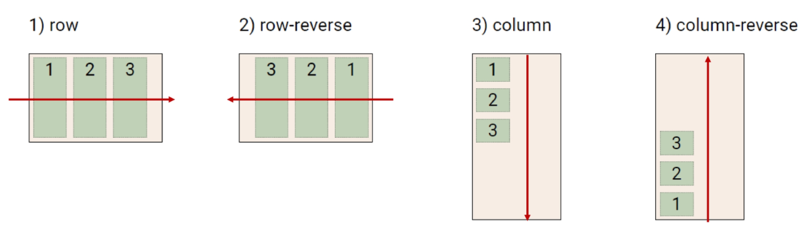

# 반응형Web (Bootstrap)

<hr>

## 1. CSS Layout

### 1.1. CSS layout techniques

* Display
* Position
* Flat (CSS1, 1996)
* Flexbox (2012)
* Grid(2017)
* 기타
  * Responsive Web Design (2010), Media Queries (2012)

<hr>

## 2. Float

CSS 기본원칙 1, 2인 모든 요소는 **네모(박스모델)**이고, 위에서부터 아래로, 왼쪽에서 오른쪽으로**(좌상단에 배치)** 쌓인다.

그렇다면 어떤 요소를 감싸는 형태로 배치는? 좌/우측 배치는?

### 2.1. Float

* 박스를 왼쪽 혹은 오른쪽으로 이동시켜 텍스트를 포함 인라인 요소들이 주변을 wraping 하도록 함
* 요소가 Normal flow를 벗어나도록 함


### 2.2. Float 속성

* none : 기본값
* left : 요소를 왼쪽으로 띄움
* right : 요소를 오른쪽으로 띄움

<예시 코드>

> Float 예시 1
>
> ```html
> <body>
>   <div class="box left">float left</div>
>   <p>lorem300 자동 완성으로 길~게</p>
> </body>
> ```
>
> ```CSS
> .box {
>   width: 150px;
>   higth: 150px;
>   border: 1px solid black;
>   background-color: crimson;
>   color: white;
>   margin-right: 30px;
> }
> 
> .left {
>   float: left;
> }
> ```
>
> 
>
> Float 예시 2
>
> ```HTML
> <body>
>   <header>
>     <div class="box1">div</div>
>   </header>
>   <div class="box2">div</div>
> </body>
> ```
>
> 
>
> ```HTML
> <body>
>   <header>
>     <div class="box1 left">div</div>
>   </header>
>   <div class="box2">div</div>
> </body>
> ```
>
> ```CSS
> <style>
>   /* style에 float left 추가*/
>   .left {
>     float: left;
>   }
> </style>
> ```
>
> 
>
> Clearing Float
>
> ```HTML
> <body>
>   <header class="clearfix">
>     <div class="box1 left">div</div>
>   </header>
>   <div class="box2">div</div>
> </body>
> ```
>
> ```CSS
> .clearfix::after {
>   content: "";
>   display: block;
>   clear: both;
> }
> ```
>
> 

### 2.3. Clearing Float

* Float는 Normal Flow에서 벗어나 부동 상태 (떠 있음)
* 따라서, 이후 요소에 대하여 Float 속성이 적용되지 않도록 Clearing이 필수적임
  * ::after : 선택한 요소의 맨 마지막 자식으로 가상 요소를 하나 생성
    * 보통 content 속성과 함께 짝지어, 요소에 장식용 콘텐츠를 추가할 때 사용
  * clear 속성 부여

### 2.4. Float 정리

* Float는 레이아웃을 구성하기 위해 필수적으로 활용 되었으며, 최근엔 Flexbox, Grid 등장과 함께 사용도가 낮아짐
* Float 활용 전략 - Normal Flow에서 벗어난 레이아웃 구성
  * 원하는 요소들을 Float로 지정하여 배치
  * 부모 요소에 반드시 Clearing Float를 하여 이후 요소부터 Normal Flow를 가지도록 지정

### 2.5. Float 활용 사례


<hr>

## 3. Flexbox

## 3.1. CSS Flexible Box Layout

* 행과 열 형태로 아이템들을 배치하는 1차원 레이아웃 모델

* 축

  * main axis (메인 축)
  * cross axis (교차 축)

  

* 구성 요소

  * Flex Container (부모 요소)
  * Flex Item (자식 요소)

### Flexbox 축

* flex-direction: row


### Flexbox의 사용 이유

이전까지 Normal Flow를 벗어나는 수단은 Float 혹은 Position => 작업의 한계 발생

(수동 값 부여 없이)

1. 수직 정렬
2. 아이템의 너비와 높이 혹은 간격을 동일하게 배치

## 3.2. Flexbox 구성 요소

* Flex Container (부모 요소)
  * flexbox 레이아웃을 형성하는 가장 기본적인 모델
  * Flex Item들이 놓여있는 영역
  * display 속성을 flex 혹은 inline-flex로 지정
* Flex Item (자식 요소)
  * 컨테이너에 속해 있는 컨텐츠(박스)

### 3.3. flexbox 시작

```CSS
.flex-container {
    display: flex;
}
```

부모 요소에 display: flex 혹은 inline-flex

### Flex 속성

* 배치 설정
  * flex-direction
  * flex-wrap
* 공간 나누기
  * justify-content (main axis)
  * align-content (cross axis)
* 정렬
  * align-items (모든 아이템을 cross axis기준으로)
  * align-self (개별 아이템)

#### flex-direction

* Main axis 기준 방향 설정
* 역방향의 경우 HTML 태그 선언 순서와 시각적으로 다르니 유의 (웹 접근성에 영향)

​	

#### flex-wrap

* 아이템이 컨테이너를 벗어나는 경우 해당 영역 내에 배치되도록 설정

* 즉, 기본적으로 컨테이너 영역을 벗어나지 않도록 함

  

#### flex-direction & flex-wrap

* flex-direction : Main axis의 방향을 설정

* flex-wrap : 요소들이 강제로 한 줄에 배치 되게 할 것인지 여부 설정

  * nowrap (기본값) : 한 줄에 배치
  * wrap : 넘치면 그 다음 줄로 배치

* flex-flow

  * flex-direction과 flex-wrap의 shorthand
  * flex-direction과 flex-wrap에 대한 설정 값을 차례로 작성

  예시) flex-flow: row nowrap;

#### justify-content

* Main axis를 기준으로 공간 배분

  

#### align-content

* Cross axis를 기준으로 공간 배분 (아이템이 한 줄로 배치되는 경우 확인할 수 없음)


#### justify-content & align-content

* 공간 배분
  * flex-start (기본 값) : 아이템들을 axis 시작점으로
  * flex-end : 아이템들을 axis 끝 쪽으로
  * center : 아이템들을 axis 중앙으로
  * space-between : 아이템 사이의 간격을 균일하게 분배
  * space-around : 아이템을 둘러싼 영역을 균일하게 분배 (가질 수 있는 영역을 반으로 나눠서 양쪽에)
  * space-evenly : 전체 영역에서 아이템 간 간격을 균일하게 분배

#### align-items

* 모든 아이템을 Corss axis를 기준으로 정렬

  * **주의! 해당 속성은 컨테이너에 적용하는 것이 아니라 개별 아이템에 적용**

  

#### align-items & align-self

* Cross axis를 중심으로
  * stretch (기본 값) : 컨테이너를 가득 채움
  * flex-start : 위
  * flex-end : 아래
  * center : 가운데
  * baseline : 텍스트 baseline에 기준선을 맞춤

#### 기타 속성

* flex-grow : 남은 영역을 아이템에 배분
* order (기본값 0) : 배치 순서

<예시 코드>

>```HTML
><div class="flex_item grow-1 order-3">1</div>
><div class="flex_item grow-1">2</div>
><div class="flex_item order-1">3</div>
><div class="flex_item order-2">4</div>
>```
>
>

### 3.4. 활용 레이아웃

* 수직 수평 가운데 정렬


* 카드 배치


*참고 - IE는 항상 지원여부를 확인하자*


<hr>

<hr>

# Bootstrap


**The world most popular front-end open source**

<hr>

## 1. Bootstrap의 자체 템플릿


<hr>

## 2. Bootstrap 사용

가이드 사이트 : https://getbootstrap.com/docs/5.0/getting-started/download/

**중요** : Bootstrap 사용 시 필수사항

> ```HTML
><!DOCTYPE html>
> <html lang="en">
> <head>
> <meta charset="UTF-8">
> <meta http-equiv="X-UA-Compatible" content="IE=edge">
>   <meta name="viewport" content="width=device-width, initial-scale=1.0">
>   
>   <link href="https://cdn.jsdelivr.net/npm/bootstrap@5.1.3/dist/css/bootstrap.min.css" rel="stylesheet" integrity="sha384-1BmE4kWBq78iYhFldvKuhfTAU6auU8tT94WrHftjDbrCEXSU1oBoqyl2QvZ6jIW3" crossorigin="anonymous">
>   
>   <title>Document</title>
>   </head>
>   <body>
> 
> <script src="https://cdn.jsdelivr.net/npm/bootstrap@5.1.3/dist/js/bootstrap.bundle.min.js" integrity="sha384-ka7Sk0Gln4gmtz2MlQnikT1wXgYsOg+OMhuP+IlRH9sENBO0LRn5q+8nbTov4+1p" crossorigin="anonymous"></script>
> </body>
>   </html>
> ```
> 
> 헤드에 
>
> ```html
><link href="https://cdn.jsdelivr.net/npm/bootstrap@5.0.2/dist/css/bootstrap.min.css" rel="stylesheet" integrity="sha384-EVSTQN3/azprG1Anm3QDgpJLIm9Nao0Yz1ztcQTwFspd3yD65VohhpuuCOmLASjC" crossorigin="anonymous">
> ```
> 
> 바디 끝에
>
> ```html
><script src="https://cdn.jsdelivr.net/npm/bootstrap@5.0.2/dist/js/bootstrap.bundle.min.js" integrity="sha384-MrcW6ZMFYlzcLA8Nl+NtUVF0sA7MsXsP1UyJoMp4YLEuNSfAP+JcXn/tWtIaxVXM" crossorigin="anonymous"></script>
> ```
> 
> 추가해야 정상적으로 적용 됨!!

## 2.1. spacing

### margin과 padding

클래스에 작성하여 요소에 적용


* mt, mx, py, pe 등의 축약어로 원하는 위치에 각 요소를 넣을 수 있음

* margin과 padding에 -(번호)를 이용해 지정된 크기로 박스를 조절할 수 있음

  * auto의 경우 중앙정렬

  1rem = 16픽셀로 기본 지정 되어있고 각 번호에 맞게 배율로 조절되어 적용됨

<예시 코드>

> mx-1 (margin 박스를 좌우로 4px 적용)
>
> pt-3 (padding 박스를 위쪽으로 16px 적용)

