# CSS

CSS : Cascading Style Sheets

* CSS 구문은 선택자를 통해 스타일을 지정할 HTML 요소를 선택
* 중괄호 안에서는 속성과 값, 하나의 쌍으로 이루어진 선언을 진행
* 각 쌍은 선택한 요소의 속성, 속성에 부여할 값을 의미
  * 속성 (Property) : 어떤 스타일 기능을 변경할지 결정
  * 값 (Value) : 어떻게 스타일 기능을 변경할지 결정

**CSS 구문** - 용어 정리


<hr>

## 1. CSS 정의 방법

* 인라인(inline)

  

* 내부 참조(embedding) - `<style>`

  

  

* 외부 참조(link file) - 분리된 CSS 파일

  

  

**TIP : 주로 활용하는 속성 위주로 기억하자!**

#### CSS with 개발자 도구

* style : 해당 요소에 선언된 모든 CSS
* computed : 해당 요소에 최종 계산된 CSS

<hr>

## 2. CSS Selectors

### 2.1. 선택자(Selector) 유형

* 기본 선택자
  * 전체 선택자, 요소 선택자
  * 클래스 선택자, 아이디 선택자, 속성 선택자
* 결합자(Combinatiors)
  * 자손 결합자, 자식 결합자
  * 일반 형제 결합자, 인접 형제 결합자
* 의사 클래스/요소(Pseudo Class)
  * 링크, 동적 의사 클래스
  * 구조적 의사 클래스, 기타 의사 클래스, 의사 엘리먼트, 속성 선택자

#### 선택자 with 개발자 도구

* #sect1 > ul > li:nth-child(1)

  


#### VScode에서 직접 해보기


### 2.2. CSS 선택자 정리

* 요소 선택자
  * HTML 태그를 직접 선택
* 클래스(class) 선택자
  * 마침표(.)문자로 시작하며, 해당 클래스가 적용된 항목을 선택
* 아이디(id) 선택자
  * `#` 문자로 시작하며, 해당 아이디가 적용된 항목을 선택
  * 일반적으로 하나의 문서에 1번만 사용. 여러 번 사용해도 동작하지만, 단일 id를 사용하는 것을 권장

### 2.3. CSS 적용 우선순위 (cascading order) !!

* CSS 우선순위를 아래와 같이 그룹을 지어볼 수 있다
  1. 중요도 (Importance) - 사용시 주의
     * !important
  2. 우선 순위 (Specificity)
     * 인라인 > id > class, 속성, pseudo-class > 요소, pseudo-element
  3. CSS파일 로딩 순서

#### Quiz


ANS.


### 2.4. CSS 상속 (MDN에도 추가로 확인!)

* CSS는 상속을 통해 부모 요소의 속성을 자식에게 상속한다

  * 속성(프로퍼티) 중에는 상속이 되는 것과 되지 않는 것들이 있다

  * 상속 되는 것 예시

    예) Text 관련 요소(font, color, text-align), opacity, visibility 등

  * 상속 되지 않는 것 예시

    예) Box model 관련 요소(width, height, margin, padding, border, box-sizing, display)

    ​	  position 관련 요소(position, top/right/bottom/left, z-index) 등

#### VScode에서 직접해보기


<hr>

## 3. CSS 기본 스타일

### 3.1. 크기 단위

* px(픽셀)
  * 모니터 해상도의 한 화소인 '픽셀' 기준
  * 픽셀의 크기는 변하지 않기 때문에 고정적인 단위
* %
  * 백분율 단위
  * 가변적인 레이아웃에서 자주 사용
* em
  * (바로 위, 부모 요소에 대한) 상속의 영향을 받음
  * 배수 단위, 요소에 지정된 사이즈에 상대적인 사이즈를 가짐
* rem
  * (바로 위, 부모 요소에 대한) 상속의 영향을 받지 않음
  * 최상위 요소(html)의 사이즈를 기준으로 배수 단위를 가짐
* viewport
  * 웹 페이지를 방문한 유저에게 바로 보이게 되는 웹 컨텐츠의 영역 (디바이스 화면)
  * 디바이스의 viewport를 기준으로 상대적인 사이즈가 결정됨
  * vw, vh, vmin, vmax

#### VScode에서 직접해보기


#### 크기 단위 em vs rem


### 3.2. 색상 단위

* 색상 키워드
  * 대소문자를 구분하지 않음
  * red, blue, black과 같은 특정 색을 직접 글자로 나타냄
* RGB 색상
  * 16진수 표기법 혹은 함수형 표기법을 사용해서 특정 색을 표현하는 방식
* HSL 색상
  * 색상, 채도, 명도를 통해 특정 색을 표현하는 방식


### 3.3. CSS 문서 표현 - 추후에 하나씩

* 텍스트
  * 서체, 서체 스타일
  * 자간, 단어 간격, 행간, 들여쓰기 등
* 컬러(color), 배경(background-image, background-color)
* 기타 HTML 태그별 스타일링
  * 목록(li), 표(table)

<hr>

## 4. Selectors 심화

* 자손 결합자
  * selectorA 하위의 모든 selectorB 요소
* 자식 결합자
  * selectorA 바로 아래의 selectorB 요소
* 일반 형제 결합자
  * selectorA의 형제 요소 중 뒤에 위치하는 selectorB 요소를 모두 선택
* 인접 형제 결합자
  * selectorA의 형제 요소 중 바로 뒤에 위치하는 selectorB 요소를 선택

### 4.1. 결합자(Combinators)

* 자손 결합자
  * selectorA 하위의 모든 selectorB 요소

<예시 코드>

>```CSS
>div span {
>    color: red;
>}
>```
>
>```HTML
><div>
>    <span>이건 빨강입니다.</span>
>    <p>이건 빨강이 아닙니다.</p>
>    <p>
>        <span>이건 빨강입니다.</span>
>    </p>
></div>
>```

* 자식 결합자
  * selectorA 바로 아래의 selectorB 요소

> ```CSS
> div > span {
>     color: red;
> }
> ```
>
> ```HTML
> <div>
>     <span>이건 빨강입니다.</span>
>     <p>이건 빨강이 아닙니다.</p>
>     <p>
>         <span>이건 빨강이 아닙니다.</span>
>     </p>
> </div>
> ```

* 일반 형제 결합자

  * selectorA의 요소 중 뒤에 위치하는 selectorB 요소를 선택

  <예시 코드>

> ```CSS
> p ~ span {
>     color: red;
> }
> ```
>
> ```HTML
> <span>p태그의 앞에 있기 때문에 이건 빨강이 아닙니다.</span>
> <p>여기 문단이 있습니다.</p>
> <b>그리고 코드도 있습니다.</b>
> <span>p태그와 형제이기 때문에 이건 빨강입니다!</span>
> <b>더 많은 코드가 있습니다.</b>
> <p>이것도 p태그와 형제이기 때문에 빨강입니다!</p>
> ```

* 인접 형제 결합자
  * selectorA의 형제 요소 중 바로 뒤에 위치하는 selectorB 요소를 선택

<예시 코드>

> ```css
> p + span {
>     color: red;
> }
> ```
>
> ```HTML
> <span>p태그의 앞에 있기 때문에 이건 빨강이 아닙니다.</span>
> <p>여기 문단이 있습니다.</p>
> <b>그리고 코드도 있습니다.</b>
> <span>p태그와 인접한 형제이기 때문에 이건 빨강입니다!</span>
> <b>더 많은 코드가 있습니다.</b>
> <p>이것도 p태그와 인접한 형제가 아니기 때문에 이건 빨강이 아닙니다.</p>
> ```

<hr>
## 5. CSS Box model

* *CSS 원칙 1*

​	모든 요소는 **네모(박스모델)**이고, 위에서부터 아래로, 왼쪽에서 오른쪽으로 쌓인다.

### 5.1. Box model

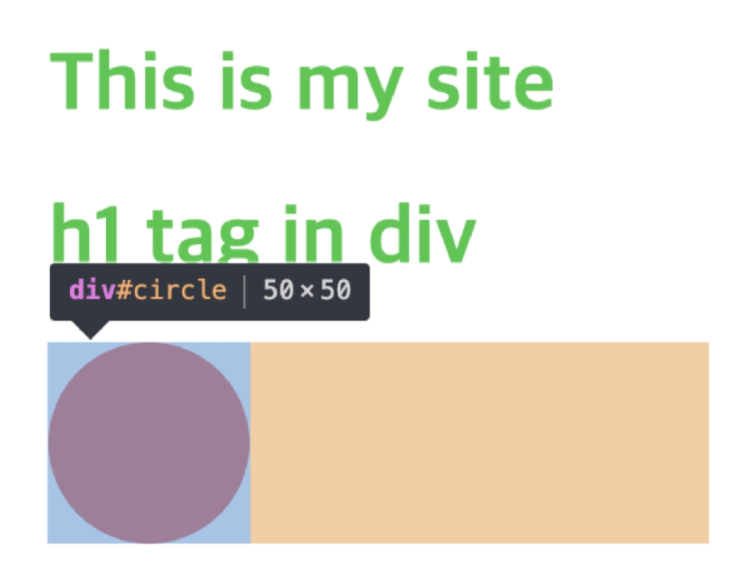

* 모든 요소는 **네모(박스모델)**이고, 위에서부터 아래로, 왼쪽에서 오른쪽으로 쌓인다. (좌상단 배치)

* 하나의 박스는 네 부분(영역)으로 이루어짐

  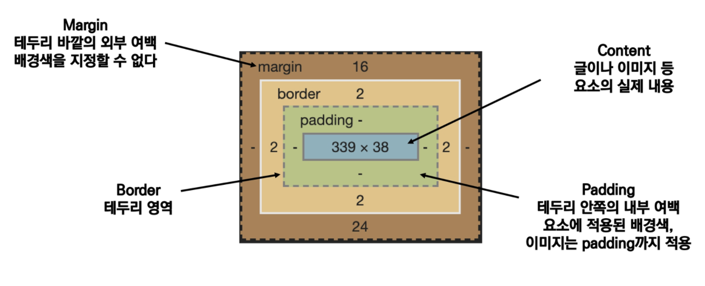

  * Margin

    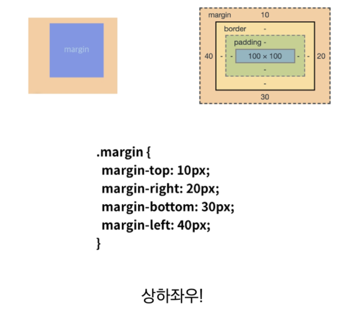

  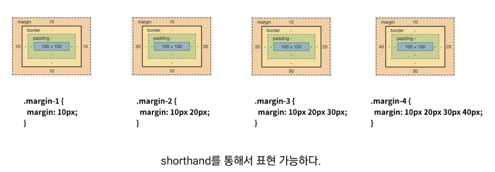

  * Padding

    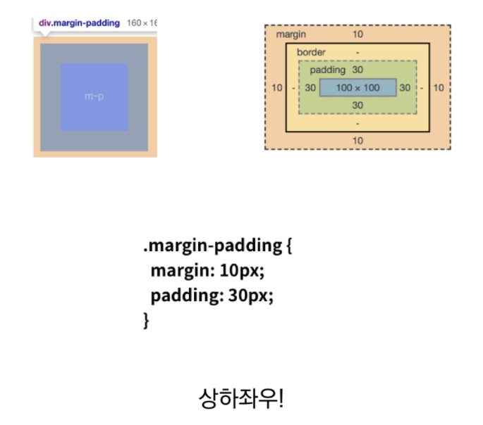

  * Border

    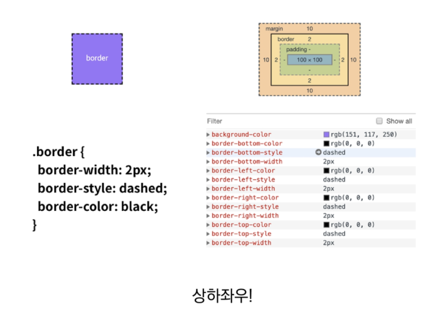

    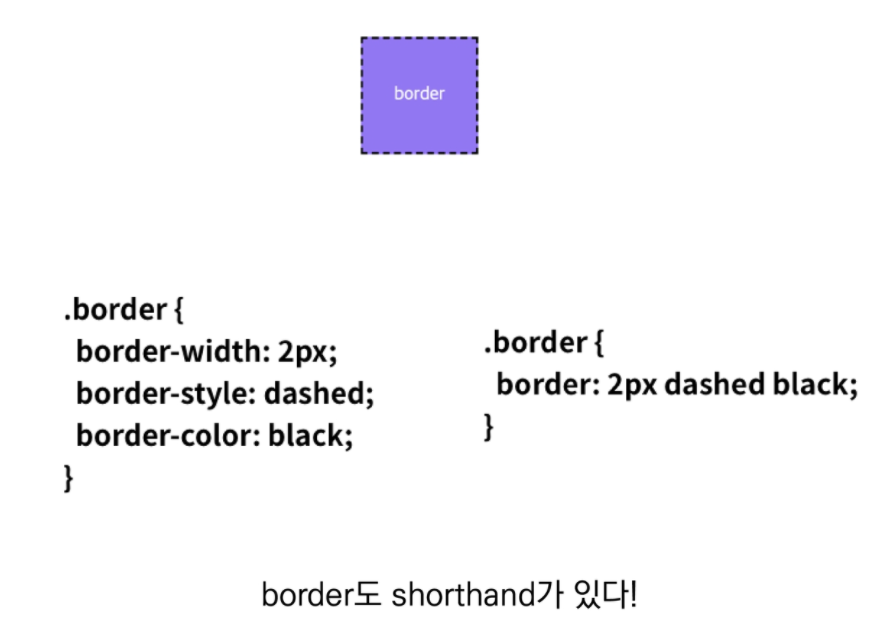

### 5.2. Box sizing

* 기본적으로 모든 요소의 box-sizing은 content-box
  * Padding을 제외한 순수 contents 영역만을 box로 지정
* 다만, 우리가 일반적으로 영역을 볼 때는 border까지의 너비를 100px로 보는 것을 원함
  * 그 경우 box-sizing을 border-box로 설정

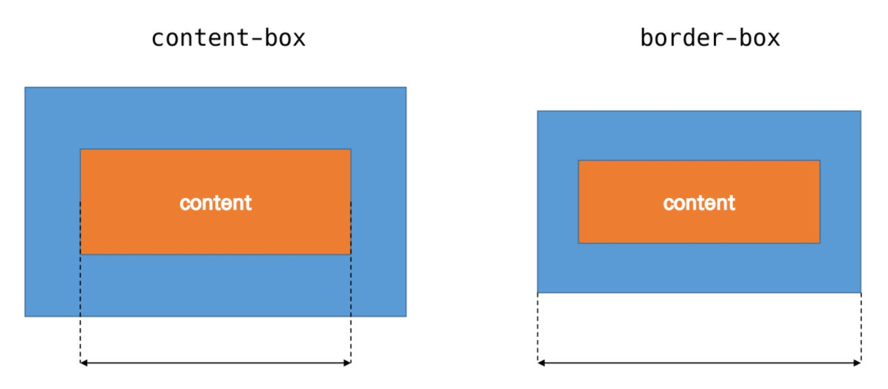

<hr>

## 6. CSS Display

* *CSS 원칙 2*

  dispay에 따라 크기와 배치가 달라진다.

### 6.1.인라인 요소와 블록 요소

#### 대표적으로 활용되는 display

* display: block
  * 줄 바꿈이 일어나는 요소
  * 화면 크기 전체의 가로 폭을 차지한다
  * 블록 레벨 요소 안에 인라인 레벨 요소가 들어갈 수 있음
* display: inline
  * 줄 바꿈이 일어나지 않는 행의 일부 요소
  * content 너비만큼 가로 폭을 차지한다
  * width, height, margin-top, margin-bottom을 지정할 수 있다.
  * 상하 여백은 line-height로 지정한다

#### 블록 레벨 요소와 인라인 레벨 요소 구분(HTML 4,1까지)

* 대표적인 블록 레벨 요소
  * div / ul, ol, li / p / hr / form 등
* 대표적인 인라인 레벨 요소
  * span / a / img / input, label / b, em, i, strong 등

#### 블록 요소의 특징

* 블록의 기본 너비는 가질 수 있는 너비의 100%

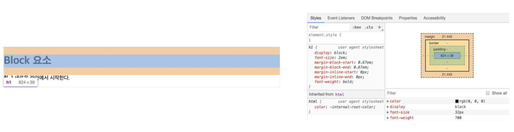

* 너비를 가질 수 없다면 자동으로 부여되는 margin

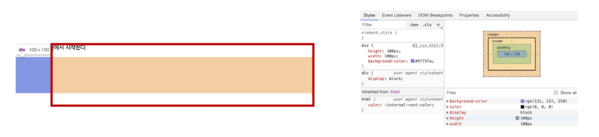

#### 인라인 요소의 특징

* inline의 기본 너비는 컨텐츠 영역만큼


### 6.2. 속성에 따른 수평 정렬

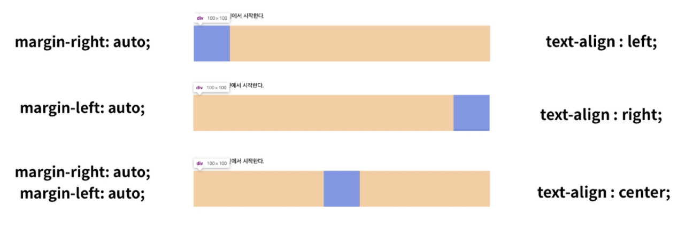

### 6.3. display

* display: inline-block
  * block과 inline 레벨 요소의 특징일 모두 가짐
  * inline처럼 한 줄에 표시 가능하고, block처럼 width, height, margin 속성을 모두 지정할 수 있음
* display: none
  * 해당 요소를 화면에 표시하지 않고, 공간조차 부여되지 않음
  * 이와 비슷한 visibility: hidden은 해당 요소가 공간은 차지하나 화면에 표시만 하지 않는다.
* 이외 다양한 display 속성은 https://developer.mozilla.org/ko/docs/Web/CSS/display

#### 직접 확인해보기

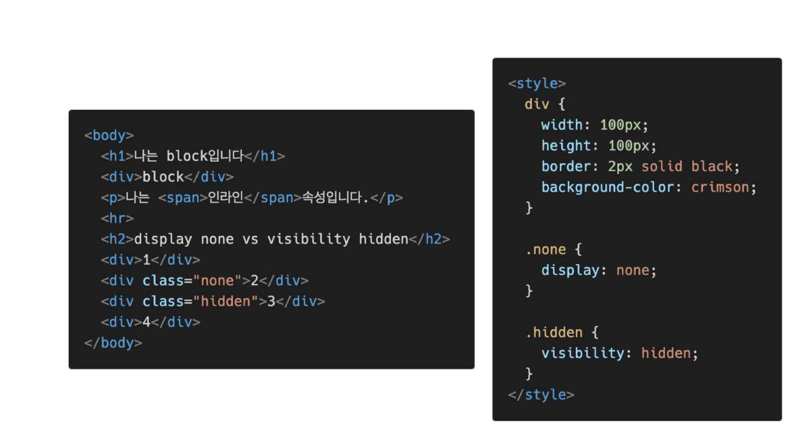

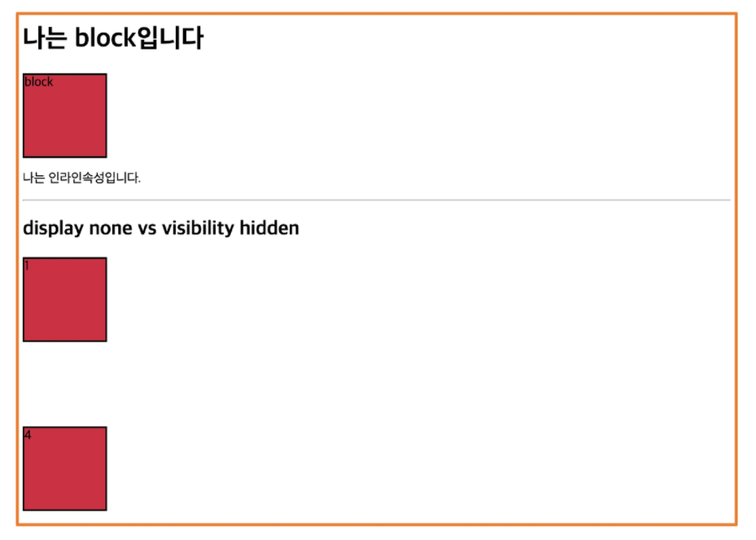

<hr>

## 7. CSS Position

