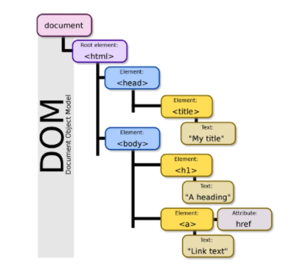
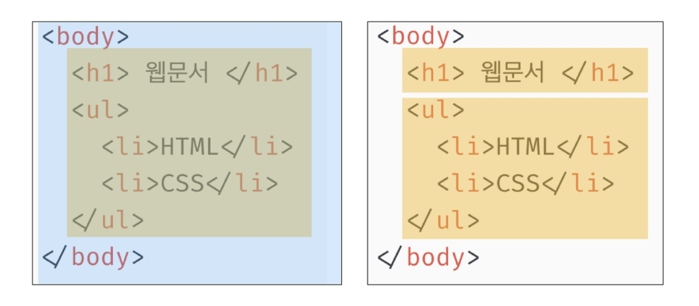
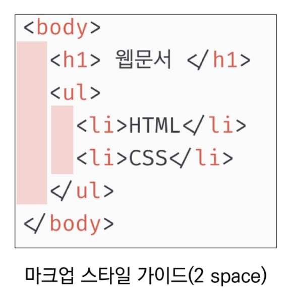
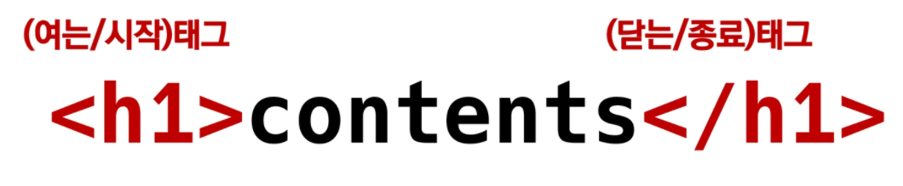
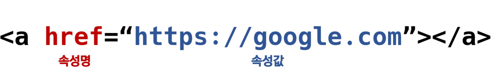
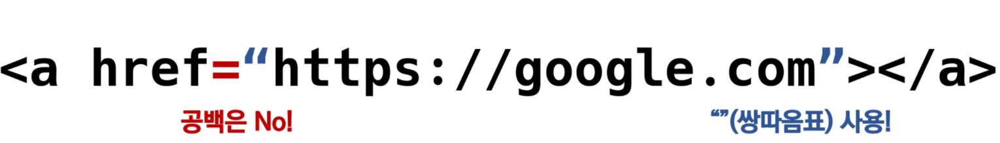
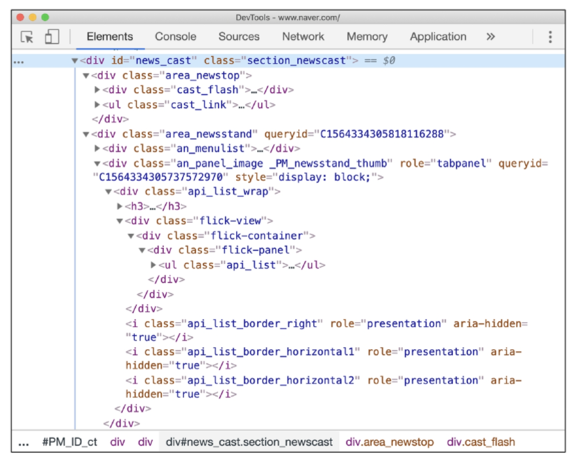
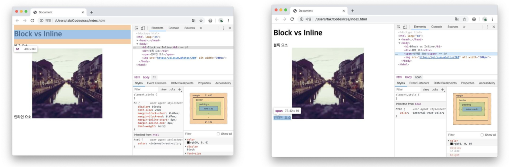

# HTML

## 1. 현재의 웹 표준

* W3C(~HTML5)가 웹 표준을 만들다가 너무 느리고 하다보니 WHATWG(Apple, Google, MS, Mozila)가 표준 재정을 시작해 W3C도 인정해 한 발 물러섰다.
* Can I use? 사이트를 통해 각 브라우저별로 지원하는 것을 확인할 수 있다.

## 2. 개발 환경 설정

### 2.1. Visual Studio Code

* HTML/CSS 코드 작성을 위한 Visual Studio Code 추천 확장 프로그램
  * Open in browser
  * Auto rename tag
  * Highlight Matching Tag
  * 공식 노션 문서 확인

### 2.2. 크롬 개발자 도구

* 웹 브라우저 크롬에서 제공하는 개발과 관련된 다양한 기능을 제공
* 주요 기능
  * Elements - DOM 탐색 및 CSS 확인 및 변경
    * Styles - DOM 탐색 및 CSS 확인 및 변경
    * Computed - 스타일이 계산된 최종 결과
    * Event Listeners - 해당 요소에 적용된 이벤트(JS)
  * Sources, Network, Performance, Application, Security, Audits 등

---

## 3. HTML(Hyper Text Markup Language)

* Hyper Text
  *  웹 페이지를 작성(구조화)하기 위한 언어
  * 참조(하이퍼링크)를 통해 사용자가 한 문서에서 다른 문서로 즉시 접근할 수 있는 텍스트

* Markup Language

  * 태그 등을 이용하여 문서나 데이터의 구조를 명시하는 언어

  > 대표적인 예 - HTML, Markdown
  >
  > ```html
  > <!DOCTYPE html>
  > <head>
  >     <meta charset="UTF-8">
  >     <title>Hello, HTML</title>
  > </head>
  > <body>
  >     
  > </body>
  > </html>
  > ```
  >
  > <!--HTML 적용 전-->
  > HTML. HTML이란 Hyper Text Markup Language의 약자이다.Hyper Text. Hyper Text란 기존의 선형적인 텍스트가 아닌 비 선형적으로 이루어진 텍스트를 의미하며, 인느 인터넷의 등장과 함께 대두되었다. 기본적으로 HyperLink를 통해 텍스트를 이동한다. 이러한 Hyper Text는 인간이 기억하는 방식까지 바꾸고 있는데 이를 컬럼비아대 뱃시 스패로 교수팀은 구글 효과(Google Effect)라고 이름붙이고, 해당 연구를 '사이언스'지에 게재하였다.
  >
  > <!--HTML 적용 후-->
  >
  > ### 1. HTML
  >
  > HTML이란 Hyper Text Markup Language의 약자이다.
  >
  > #### 1.1. Hyper Text
  >
  > Hyper Text란 기존의 선형적인 텍스트가 아닌 비 선형적으로 이루어진 텍스트를 의미하며, 인느 인터넷의 등장과 함께 대두되었다. 기본적으로 HyperLink를 통해 텍스트를 이동한다.
  >
  > 이러한 Hyper Text는 인간이 기억하는 방식까지 바꾸고 있는데 이를 컬럼비아대 뱃시 스패로 교수팀은 구글 효과(Google Effect)라고 이름붙이고, 해당 연구를 '사이언스'지에 게재하였다.
  >
  > #### 1.2. 구글효과(Google Effect)
  >
  > 구글 효과란...
  >
  > <!--HTML 구조 예시-->
  >
  > `<h1>HTML</h1>`
  >
  > `<p>HTML이란 Hyper Text Markup Language의 약자이다.</p>`
  >
  > `<h2>Hyper Text</h2>`
  >
  > `<p>Hyper Text란 기존의 선형적인 텍스트가 아닌 비 선형적으로 이루어진 텍스트를 의미하며, 인느 인터넷의 등장과 함께 대두되었다. 기본적으로 HyperLink를 통해 텍스트를 이동한다.</p>`
  >
  > `<p>이러한 Hyper Text는 인간이 기억하는 방식까지 바꾸고 있는데 이를 컬럼비아대 뱃시 스패로 교수팀은 구글 효과(Google Effect)라고 이름붙이고, 해당 연구를 '사이언스'지에 게재하였다.</p>`
  >
  > `<h2>구글효과(Google Effect)</h2>`
  >
  > `<p>구글 효과란...</p>`

---

## 4. HTML 기본 구조

* html : 문서의 최상위(root) 요소
* head: 문서 메타데이터 요소
  * 문서 제목, 인코딩, 스타일, 외부 파일 로딩 등
  * 일반적인 브라우저에 나타나지 않는 내용
* body : 문서 본문 요소
  * 실제 화면 구성과 관련된 내용

<예시 코드>

> ```HTML
> <!DOCTYPE html>
> <html lang="ko">
> <head>
>   <meta charset="UTF-8">
>     <title>Document</title>
> </head>
> <body>
>     
> </body>
> </html>
> ```

### 4.1. head 예시

* `<title>` : 브라우저 상단 타이틀

* `<meta>` : 문서 레벨 메타데이터 요소
* `<link>` : 외부 리소스 연결 요소 (CSS 파일, favicon 등)
* `<script>` : 스크립트 요소 (JavaScript 파일/코드)
* `<style>` : CSS 직접 작성

<예시 코드>

> ```HTML
> <head>
>     <title>HTML 수업</title>
>     <meta charset="UTF-8">
>     <link href="style.css" rel="stylesheet">
>     <script src="javascript.js"></script>
>     <style>
>     p {
>         color: black;
>     }
>     </style>
> </head>
> ```

#### Open Graph Protocol

* 메타 데이터를 표현하는 새로운 규약
  * HTML 문서의 메타 데이터를 통해 문서의 정보를 전달
  * 메타정보에 해당하는 제목, 설명 등을 쓸 수 있도록 정의

### 4.2. DOM(Document Object Model) 트리

* 텍스트 파일인 HTML 문서를 브라우저에서 렌더링 하기 위한 구조
  * HTML 문서에 대한 모델을 구성함
  * HTML 문서 내의 각 요소에 접근 / 수정에 필요한 프로퍼티와 메서드를 제공함







### 4.3. 요소(element)

* HTML의 요소는 시작 태그와 종료 태그 그리고 태그 사이에 위치한 내용(contents)으로 구성되어 있다.
  * 태그(Element, 요소)는 컨텐츠(내용)를 감싸는 것으로 그 정보의 성격과 의미를 정의



* 내용이 없는 태그들
  * br, hr, img, input, link, meta
* 요소는 중첩(nested)될 수 있음
  * 요소의 중첩을 통해 하나의 문서를 구조화
  * 여는 태그와 닫는 태그의 쌍을 잘 확인해야함
    * 오류를 반환하는 것이 아닌 그냥 레이아웃이 깨진 상태로 출력되기 때문에, 디버깅이 힘들어 질 수 있음

### 4.4. 속성(attribute)

* 태그별로 사용할 수 있는 속성은 다르다.



* 속성 지정 스타일 가이드



* 속성을 통해 태그의 부가적인 정보를 설정할 수 있음
* 요소는 속성을 가질 수 있으며, 경로나 크기와 같은 추가적인 정보를 제공
* 요소의 시작 태그에 작성하며 보통 이름과 값이 하나의 쌍으로 존재
* 태그와 상관없이 사용 가능한 속성(HTML Global Attribute)들도 있음

#### HTML Global Attribute

* 모든 HTML 요소가 공통으로 사용할 수 있는 대표적인 속성 (몇몇 요소에는 아무 효과가 없을 수 있음)
  * id : 문서 전체에서 유일한 고유 식별자 지정
  * class : 공백으로 구분된 해당 요소의 클래스의 목록 (css, JS에서 요소를 선택하거나 접근)
  * data-* : 페이지에 개인 사용자 정의 데이터를 저장하기 위해 사용
  * style : inline 스타일
  * title : 요소에 대한 추가 정보 지정
  * tabindex : 요소의 탭 순서

### 4.5. HTML 코드 예시

```HTML
<!DOCTYPE html>
<html lang="en">
<head>
  <meta charset="UTF-8">
  <title>Hello, HTML</title>
</head>
<body>
  <!-- 이것은 주석입니다. -->
  <h1>이것은 본문입니다.</h1>
  <span>이것은 인라인요소</span>
  <a href="https://www.naver.com">네이버로 이동!!</a>
</body>
</html>
```



### 4.6. 시맨틱 태그

* HTML5에서 의미론적 요소를 담은 태그의 등장

  * 기존 영역을 의미하는 div태그를 대체하여 사용

* 대표적인 태그 목록

  * header : 문서 전체나 섹션의 헤더(머리말 부분)
  * nav : 내비게이션
  * aside : 사이드에 위치한 공간, 메인 콘텐츠와 관련성이 적은 콘텐츠
  * section : 문서의 일반적인 구분, 컨텐츠의 그룹을 표현
  * article : 문서, 페이지, 사이트 안에서 독립적으로 구분되는 영역
  * footer : 문서 전체나 섹션의 푸터(마지막 부분)

  <예시 코드>

  > ```HTML
  > <!--시맨틱 태그 적용 전-->
  > <div>
  >     <div></div>
  > </div>
  > <div>
  >     <div></div>
  >     <div></div>
  > </div>
  > <div></div>
  > ```
  >
  > ```HTML
  > <!--시맨틱 태그 적용 후-->
  > <!--각 파트의 의미 구분개선-->
  > <header>
  >     <nav></nav>
  > </header>
  > <section>
  >   <article></article>
  >   <article></article>
  > </section>
  > <footer></footer>
  > ```

* Non semantic 요소는 div, span 등이 있으며 h1, table 태그들도 시맨틱 태그로 볼 수 있음

* 개발자 및 사용자 뿐만 아니라 검색엔진 등에 의미 있는 정보의 그룹을 태그로 표현

* 단순히 구역을 나누는 것 뿐만 아니라 '의미'를 가지는 태그들을 활용하기 위한 노력

* 요소의 의미가 명확해지기 때문에 코드의 가독성을 높이고 유지보수를 쉽게 함

* 검색엔진최적화(SEO)를 위해서 메타태그, 시맨틱 태그 등을 통한 마크업을 효과적으로 활용 해야함

---

## 5. HTML 문서 구조화

### 5.1. 인라인/블록 요소



블록 요소(좌) / 인라인 요소(우)

* 블록 요소는 라인 전체를 차지
* 인라인 요소는 그 자체만의 공간을 차지, 블록요소 내부에 들어갈 수 있음

자세한 내용은 CSS에서!!

### 5.2. 텍스트 요소

| 태그                               | 설명                                                         |
| ---------------------------------- | ------------------------------------------------------------ |
| `<a></a>`                          | href 속성을 활용하여 다른 URL로 연결하는 하이퍼링크 생성     |
| `<b></b>`<br />`<strong></strong>` | 굵은 글씨 요소<br />중요한 강조하고자 하는 요소 (보통 굵은 글씨로 표현) |
| `<i></i>`<br />`<em></em>`         | 기울임 글씨 요소<br />중요한 강조하고자 하는 요소 (보통 기울임 글씨로 표현) |
| `<br>`                             | 텍스트 내에 줄 바꿈 생성                                     |
| ``                            | src 속성을 활용하여 이미지 표현                              |
| `<span></span>`                    | 의미 없는 인라인 컨테이너                                    |

#### 실행결과

* a 태그

​	<a>lorem ipsum dolor sit amet, consectetur adipiscing elit.</a>

* b 태그

  <b>lorem ipsum dolor sit amet, consectetur adipiscing elit.</b>

* strong 태그

  <strong>lorem ipsum dolor sit amet, consectetur adipiscing elit.</strong>

* i 태그

  <i>lorem ipsum dolor sit amet, consectetur adipiscing elit.</i>

* em 태그

  <em>lorem ipsum dolor sit amet, consectetur adipiscing elit.</em>

* span 태그

  <span>lorem ipsum dolor sit amet, consectetur adipiscing elit.</span>

### 5.3. 그룹 컨텐츠

| 태그                         | 설명                                                         |
| ---------------------------- | ------------------------------------------------------------ |
| `<p></p>`                    | 하나의 문단 (paragraph)                                      |
| `<hr>`                       | 문단 레벨 요소에서의 주제의 분리를 의미하며 수평선으로 표시 됨 (A Horizontal Rule) |
| `<ol></ol>`<br />`<ul></ul>` | 순서가 있는 리스트 (ordered)<br />순서가 없는 리스트 (unordered) |
| `<pre></pre>`                | HTML에 작성한 내용을 그대로 표현.<br />보통 고정폭 글꼴이 사용되고 공백문자를 유지 |
| `<blockquote></blockquote>`  | 텍스트가 긴 인용문<br />주로 들여쓰기를 한 것으로 표현됨     |
| `<div></div>`                | 의미 없는 블록 레벤                                          |

