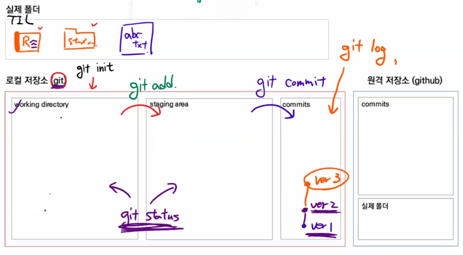

## Git

### Git을 이용하는 이유

* Git을 이용한 버전관리

버전 : 컴퓨터 소프트웨어의 특정 상태

관리 : 어떤 일의 사무, 시설이나 물건의 유지, 개량

프로그램 : 진행 계획이나 순서. 또는, 그 목록. 순화어는 '계획(표)', '차례(표)'.


* 버전 관리 프로그램이란?

> 만약 버전을 제대로 관리하지 못하면?

찐막 - 찐찐막 - 최종 - 진짜 최종 ... (어느게 진짜 최종이지?) => 날짜를 붙여 정리 (뭘 수정했지?)

=> 변경사항을 기록하는 파일을 따로 만들기(용량이...) => **수정 된 자료들은 변경사항만 남기자**

(이전 시점 파일이 필요하면?) => 최종본부터 역으로 취소하면서 되짚기


**변경사항**과 **최종파일**만 남기는 것이 버전 관리 프로그램의 메인컨셉

`+` 수정한 이유에 대해서는 알 수 없음, 따로 기록해 줘야함! - 인수인계, 문서로써의 소통 굿


* '__분산__' 버전 관리 프로그램

중앙집중식 버전관리 - 변경 이력을 중앙이 관리, 개별 사용자는 접속해서 확인 => 저장소가  터지면 끝

**분산 버전 관리** - 변경 이력을 모두가 가지고 있음 => 한 곳이 잘못되도 다른 사용자 보유 정보로 **복구 가능**

Meme **프로그래머는 불이나면 데이터를 깃에 푸시하고 탈출한다** - 그만큼 중요하다


* Github을 이용한 포트폴리오

지금까지 해온 흔적으로 사람을 판단할 수 밖에 없음 - 그 흔적을 Github에 남긴다(잔디를 심자!)


* GitBash에서 TIL 폴더 git연동

TIL 폴더에서 우클릭 => Gitbash 열기 => bash에서 `git init`입력 => 3개 공간이 생성됨




로컬 저장소 (내 컴퓨터) : working directory(작업공간) - Staging Area - Local Repository

Working directory : 실제 폴더를 참조해 변화된 내용을 가져옴

Staging Area : 업로드 전 확인/검수하는 공간 (불필요한게 있나? 빠진건 없나?)

Local Repository : 변경사항에 대한 ver 생성


working directory => Staging Area

```bash
git add 파일경로
```

현재 디렉토리의 모든 파일을 추가하고 싶다면

```bash
git add .
```


* Working directory와 Staging Area 상태를 확인하는 법

  ```bash
  git status
  ```

  * untracked : 처음으로 관리되는 대상(새로 생성 등)이 Working directory에 있는 상태 
    * Wd에 있으면 빨간색 => SA에 올라가면 초록색

  * tracked : 관리되고 있는 대상 (Staging Area에 올라간 이력이 있는 파일)
    * modified : 수정 된 파일, Wd에 있으면 빨간색 => SA에 올라가면 초록색
    * unmodified : 별도 색 X


Staging Area => Local Repository

> 최초 실행 시 사용자 정보 필요
>
> ```bash
> git config --global user.email 가입메일
> ```
>
> ```bash
> git config --global user.name Git닉네임
> ```

```bash
git commit
```

커밋 후 텍스트 에디터 뜸 - 변경이유 기록을 위한 창 - i 누르기 - 아랫줄에 이유 입력(#주석 지워야함) - esc 누르기 - :wq이력 후 엔터


> 더 쉽게 commit하는 방법
>
> ```bash
> git commit -m '변경이유'
> ```
>
> 텍스트 에디터 들어가지 않고 commit가능


* commit된 상태를 확인하는 법

```bash
git log
```

 commit 해쉬정보, 업로드 한 사람 이름, 날짜, 이유 출력됨


변경사항 발생 => Working directory가 추적 => Staging Area에서 검수 => Local Repository ver2 생성 및 git은 이제 ver2 참조


>.git 폴더를 지우면? - 여태 관리하던 git 과의 연동이 끊김, (master)도 사라짐, 작업내용 날아감 - 왜냐하면 아직 local(내컴퓨터)에만 업로드, github사이트에 업로드 X 
>
>편집한지 얼마 안됐거나 지워도 되는 경우 외엔 함부로 삭제 금지


* Github에 올리려면 

  1. 원격 저장소 정보 등록(url)

     ```bash
     git remote add origin https://github.com/닉네임/경로.git
     ```

     .git은 생략가능, origin(컨벤션)은 remote 별명 - 내가 메인으로 쓰는 repository가 저장됨

     

  2. 업로드 할 내용을 push한다.

     ```bash
     git push -u origin master
     ```

     입력하면 Github사이트에 업로드 됨, 한번 한 이후에는

     ```bash
     git push
     ```

     만 입력해도 업로드 가능


> origin을 잘못 등록했다면 
>
> git remote -v로 origin 정보 불러오기 => git remote add origin 불러온오리진정보 로 제거 => 다시 origin등록


버전 정보는 원격저장소 기준 : 만약 A로컬에서 v1-v2 업로드, 이후 B로컬에서 v1-v2-b3업로드 => A에서 v1-v2-v3로 업로드 하려고 함 => 원격에서 b3없다고 업로드 막음 => b3를 다운로드(Pull)하는 과정 필요!
